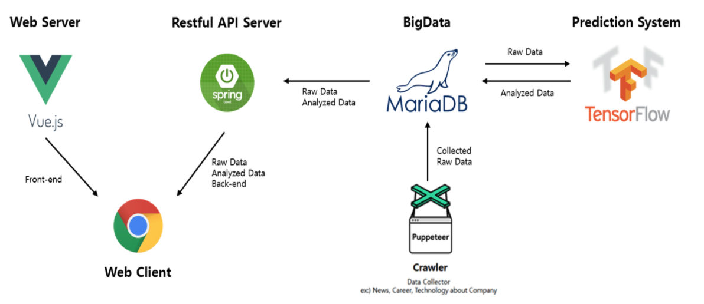
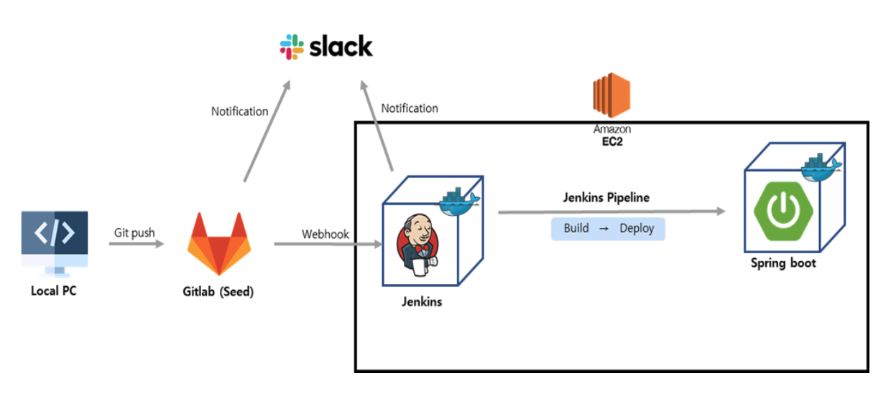
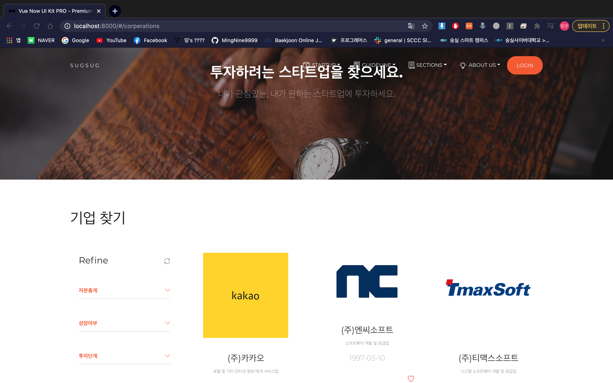
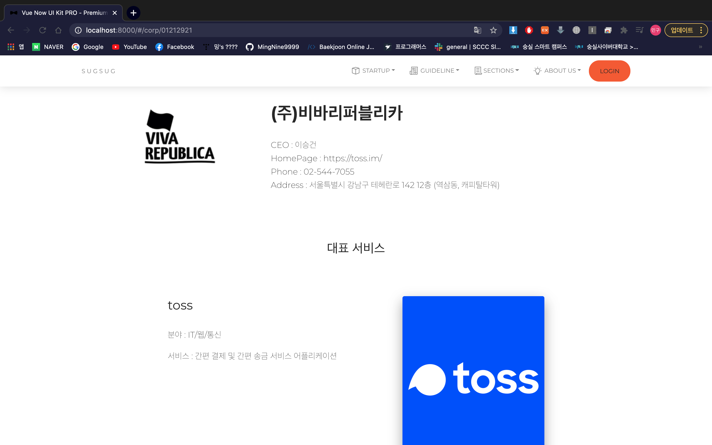
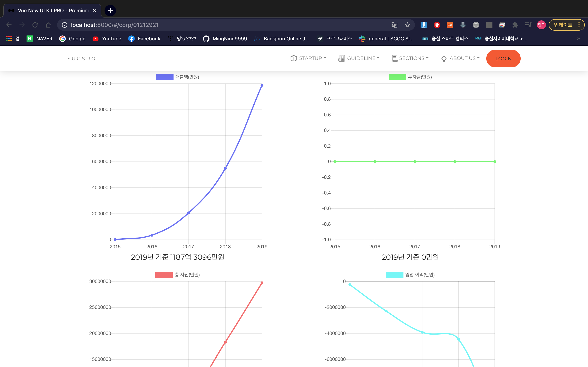
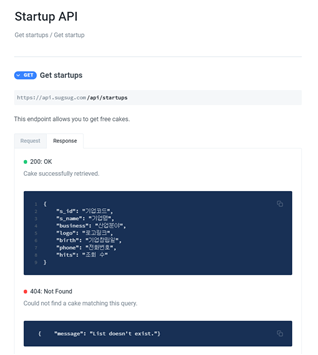
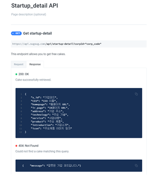
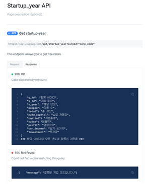

# 쑥쑥 (SUGSUG)

성공적인 스타트업의 성장과 투자를 위한 가이드라인을 제공하고, 개인투자자와 스타트업을 매칭시켜주는 웹 플랫폼 입니다.

## Motivation

In the face of growing interest in investment, a web platform that matches individual investors and startups is needed.

투자에 대한 관심이 높아지는 상황에서 개인 투자자와 스타트업을 매칭시켜주는 웹 플랫폼이 필요합니다.

## Features

- Providing information about startups

- Communication between startups and individual investors

- Trend Analysis

- Holding a startup investment briefing

- 스타트업 정보 제공

- 스타트업과 개인투자자 간 소통

- 트렌드 분석

- 스타트업 투자설명회 개최

## Screenshots
프로젝트 개요

CI/CD 개발환경 구현

기업 목록

기업정보

기업정보 그래프

## API 문서

## Tech/framework used

* [Spring Boot](https://spring.io/projects/spring-boot) - 웹 프레임워크
* [Vue.js](https://kr.vuejs.org/v2/guide/index.html) - 웹 프레임워크
* [Maven](https://maven.apache.org/) - 의존성 관리 프로그램
* [Jenkins](https://www.jenkins.io/) - CI/CD 개발환경 구축

## 저자

* **Eunji Kim** - *웹 개발* - [ijnuemik](https://github.com/ijnuemik)
* **Mingu Song** - *데이터 수집 및 처리* - [MingNing9999](https://github.com/MingNine9999)

## 라이센스

## 감사 인사

* 프로젝트를 믿고 지원해주시는 SW Maestro와 멘토님들께 감사드립니다.

---